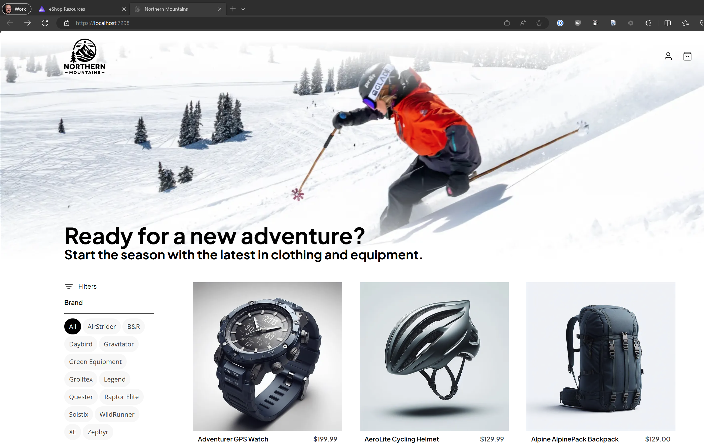

# .NET eShop - App Building Workshop

## WORK IN PROGRESS

This repo is a work in progress and not ready for consumption as a workshop as yet. Stay tuned.

## Setup

[Download](https://www.microsoft.com/net/download) and install the .NET SDK.

If you're on Windows, we recommend using [Visual Studio 2022 Preview](https://visualstudio.com/preview).

> Note: When installing Visual Studio you only need to install the `ASP.NET and web development` workload.

If you're in an instructor-led workshop session and have issues downloading the installers we may have USB sticks with offline installers for you to use.

## What you'll be building

In this workshop, you'll learn by building out features of the [eShop Reference Application](https://github.com/dotnet/eshop). We'll start from File/New and build up to some API back-end applications, a web front-end application, and a [.NET Aspire](https://learn.microsoft.com/dotnet/aspire/get-started/aspire-overview) [AppHost project](https://learn.microsoft.com/dotnet/aspire/fundamentals/app-host-overview#app-host-project) to coordinate them all together.

### Application Architecture

TODO

## Labs

The workshop consists of a series of labs, over which you'll build the eShop application.

1. [Create the Catalog API](./labs/1-Create-Catalog-API/)
2. [Create the Blazor frontend](./labs/2-Create-Blazor-Frontend/)
3. [Add an Identity Provider & authentication](./labs/3-Add-Identity/)
4. [Add shopping basket capabilities](./labs/4-Add-Shopping-Basket/)
5. [Add checkout & order capabilities](./labs/5-Add-Checkout/)
6. [Add resiliency](./labs/6-Add-Resiliency/)
7. [Deployment](./labs/7-Deployment/)
